# API Alerta Bus Rio 🚌

[](https://opensource.org/licenses/MIT)

API e Aplicação Web para monitoramento em tempo real de ônibus da cidade do Rio de Janeiro, permitindo a criação de alertas de proximidade personalizados por e-mail.

**Observação:** Este projeto foi desenvolvido como parte do processo seletivo da **Maravi**.

## Visão Geral

Este projeto consiste em um Web App completo (Backend FastAPI + Frontend React) que:

1.  Coleta dados de posicionamento dos ônibus do Rio de Janeiro a cada minuto via API pública ([Dados Abertos de Mobilidade Urbana](https://dados.mobilidade.rio/)).
2.  Permite aos usuários definir um **ponto de partida** (selecionado no mapa) e uma **linha de ônibus** de interesse.
3.  Permite aos usuários configurar uma **janela de horário diária** e uma **data de início** para receber notificações por e-mail.
4.  Monitora continuamente os ônibus da linha selecionada em relação ao ponto definido pelo usuário.
5.  Utiliza uma API externa (ex: [Travel Time API](https://traveltime.com/)) para calcular o **tempo estimado de chegada (ETA)** dos ônibus ao ponto, otimizando as chamadas com filtros de distância e aproximação.
6.  Envia uma **notificação por e-mail** ao usuário quando um ônibus monitorado está a aproximadamente **10 minutos** de chegar ao ponto, dentro da janela de horário e após a data de início definida.
7.  Apresenta uma interface com:
    - Mapa interativo para seleção de ponto e visualização dos ônibus.
    - Tabela com informações dos ônibus da linha selecionada (Ordem, Velocidade, ETA, Aproximação, Distância).
    - Formulário para configuração do alerta.

## Funcionalidades Principais

- Coleta de dados de geolocalização de ônibus em tempo real.
- Seleção de ponto de partida via mapa interativo (Leaflet).
- Criação de Alertas personalizados por usuário (Linha, Ponto, Janela de Horário Diária, Data de Início, Email).
- Cálculo de distância Haversine e análise de aproximação.
- Cálculo de Tempo Estimado de Chegada (ETA) via API externa (Travel Time).
- Monitoramento em background (Celery) para verificação de alertas.
- Envio de notificações por e-mail (SMTP via Gmail App Password).
- API RESTful (FastAPI) para comunicação Frontend-Backend.
- Interface reativa (React) com tabela e mapa de ônibus.
- Containerização completa com Docker e Docker Compose.

## Tecnologias Utilizadas

- **Backend:**
  - Python 3.13+
  - FastAPI
  - SQLModel (com base no SQLAlchemy e Pydantic)
  - Celery (com Redis como Broker/Backend)
  - Uvicorn
  - python-dotenv
  - httpx (ou requests)
  - psycopg2-binary (Driver PostgreSQL)
- **Frontend:**
  - React
  - Vite
  - Tailwind CSS
  - Axios
  - react-leaflet (e leaflet)
  - react-hook-form (e yup)
  - date-fns
  - @heroicons/react
- **Banco de Dados & Cache:**
  - PostgreSQL (v17+)
  - Redis (v7+)
- **Ambiente:**
  - Docker
  - Docker Compose

## Estrutura do Projeto (Simplificada)

```
.
├── backend/                \# Código do FastAPI, Celery, Services, Models
│   ├── app/
│   └── Dockerfile
├── frontend/               \# Código do React (Vite)
│   ├── public/
│   ├── src/
│   └── Dockerfile
├── markdown/               \# Documentação auxiliar
│   └── configurar_gmail.md
├── screenshots/            \# Pasta com os prints da aplicação
├── .env                    \# Arquivo local com variáveis de ambiente (NÃO versionado)
├── .env.example            \# Arquivo de exemplo para variáveis de ambiente (Versionado)
├── .gitignore
├── docker-compose.yml      \# Orquestração dos containers
└── README.md               \# Este arquivo
```

## Começando

Siga estas instruções para configurar e rodar o projeto localmente usando Docker.

### Pré-requisitos

- Git
- Docker ([Instalação](https://docs.docker.com/engine/install/))
- Docker Compose ([Geralmente incluído com Docker Desktop](https://docs.docker.com/compose/install/))

### Instalação

1.  **Clone o Repositório:**

    ```bash
    git clone https://github.com/Lucas-I-Marciano/mobility-rio.git
    cd mobility-rio
    ```

2.  **Configure as Variáveis de Ambiente:**

    - Copie o arquivo de exemplo ou crie um novo arquivo chamado `.env` na raiz do projeto:
      ```bash
      cp .env.example .env
      ```
    - Edite o arquivo `.env` e preencha **TODAS** as variáveis necessárias. Ele deve conter algo como:

      ```dotenv
      # Configuração do Banco de Dados (PostgreSQL)
      DATABASE_URL=postgresql://<user>:<password>@db:<pord>/<db>
      POSTGRES_USER=user
      POSTGRES_PASSWORD=password
      POSTGRES_DB=database_name

      # Configuração do Redis (para Celery)
      REDIS_URL=redis://redis:6379/0
      REDIS_HOST=redis
      REDIS_PORT=6379_recomended
      REDIS_DB=0_recomended

      # Configuração de Email (Gmail SMTP)
      SENDER_EMAIL=seu_email_gmail@gmail.com # <<< SEU EMAIL GMAIL
      GMAIL_APP_PASSWORD=xxxx yyyy zzzz wwww # <<< SUA SENHA DE APP GERADA (16 letras sem espaços)

      # Configuração da API Travel Time
      TRAVELTIME_APP_ID=SEU_APP_ID_TRAVELTIME # <<< SUA CREDENCIAL TRAVEL TIME
      TRAVELTIME_API_KEY=SUA_API_KEY_TRAVELTIME # <<< SUA CREDENCIAL TRAVEL TIME
      ```

    - **IMPORTANTE (GMAIL_APP_PASSWORD):** Você **NÃO** deve usar a senha normal da sua conta Gmail. É necessário gerar uma **"Senha de App"** específica nas configurações de segurança da sua Conta Google (requer autenticação de 2 fatores ativa).
      - ➡️ **Instruções detalhadas:** [markdown/configurar_gmail.md](markdown/configurar_gmail.md)
    - **IMPORTANTE (TRAVELTIME):** Você precisa se cadastrar no site [Travel Time](https://traveltime.com/) para obter um `Application Id` e uma `Api Key` gratuitos (possuem limites de uso).

3.  **Garanta que o arquivo `.env` NÃO seja enviado para o Git:** Verifique se seu arquivo `.gitignore` contém a linha `.env`.

### Rodando a Aplicação

1.  **Construa e Inicie os Containers:** No terminal, na raiz do projeto (onde está o `docker-compose.yml`), execute:

    ```bash
    docker compose up --build -d
    ```

    - `--build`: Reconstrói as imagens se houver mudanças nos Dockerfiles ou dependências.
    - `-d`: Roda os containers em background (detached mode).

2.  **Acesse a Aplicação:**

    - **Frontend (React):** Abra seu navegador e acesse [`http://localhost:5173`](http://localhost:5173)
    - **Backend API Docs (Swagger UI):** Acesse [`http://localhost:8000/docs`](http://localhost:8000/docs)
    - **Backend API Docs (ReDoc):** Acesse [`http://localhost:8000/redoc`](http://localhost:8000/redoc)

3.  **Primeira Execução:** Pode levar um ou dois minutos após iniciar os containers para que as tarefas Celery comecem a buscar os dados dos ônibus e popularem o cache Redis. Se a aplicação parecer vazia inicialmente, aguarde um pouco e atualize.

### Parando a Aplicação

Para parar os containers, execute no terminal na raiz do projeto:

```bash
docker compose down
```

_(Use `docker compose down -v` se quiser remover também os volumes, como o de dados do PostgreSQL)._

## Documentação da API

A documentação interativa da API está disponível em:

- **Swagger UI:** [`http://localhost:8000/docs`](https://www.google.com/search?q=http://localhost:8000/docs)
- **ReDoc:** [`http://localhost:8000/redoc`](https://www.google.com/search?q=http://localhost:8000/redoc)

## Screenshots

**<span style="font-size:16px;">1. Tela Inicial (Boas-vindas / Permissão)</span>**  
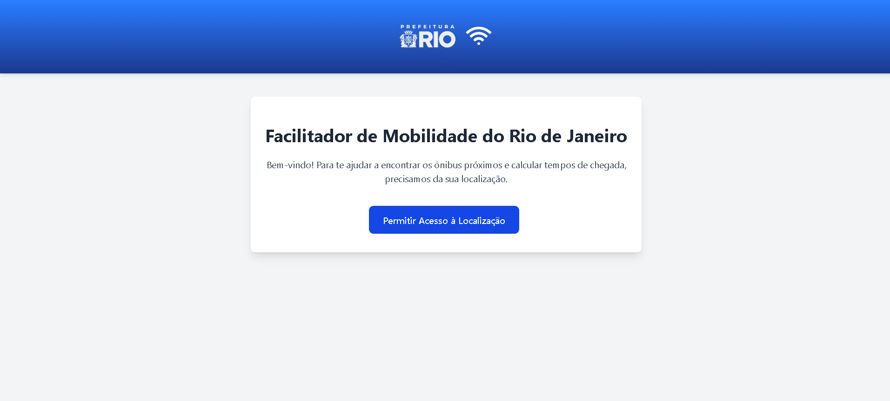  
Ao clicar no botão, será solicitada a permissão de localização.  
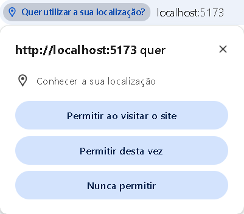  
Após aceitar, o botão será liberado para direcioná-lo à próxima tela.  
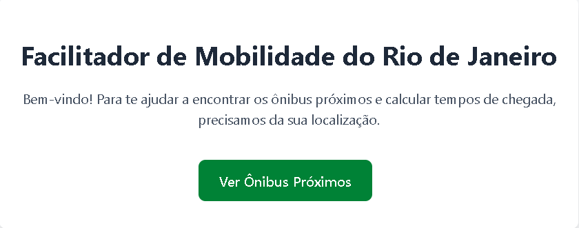

**<span style="font-size:16px;">2. Tela de Confirmação de Localização (Dispositivo)</span>**  
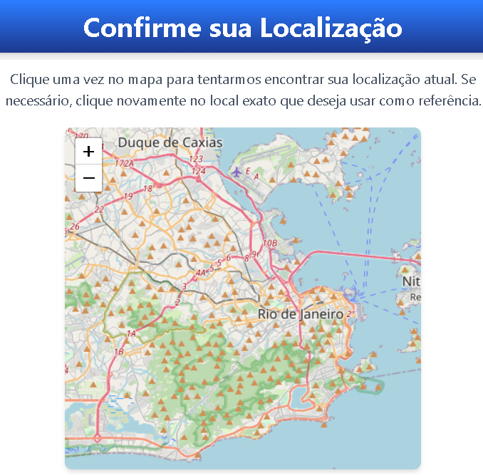  
Ao clicar no mapa, ele voará até sua localização atual.  
Se a localização estiver incorreta, clique novamente no mapa para marcar o local exato e, em seguida, clique no botão de confirmação.  
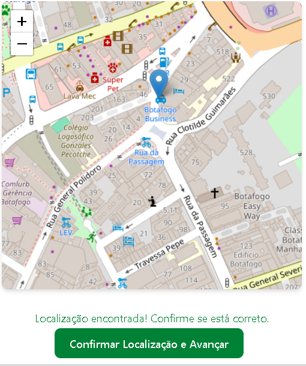

**<span style="font-size:16px;">3. Tela Principal (Escolha do Ponto, Formulário, Mapa e Tabela de Ônibus)</span>**  
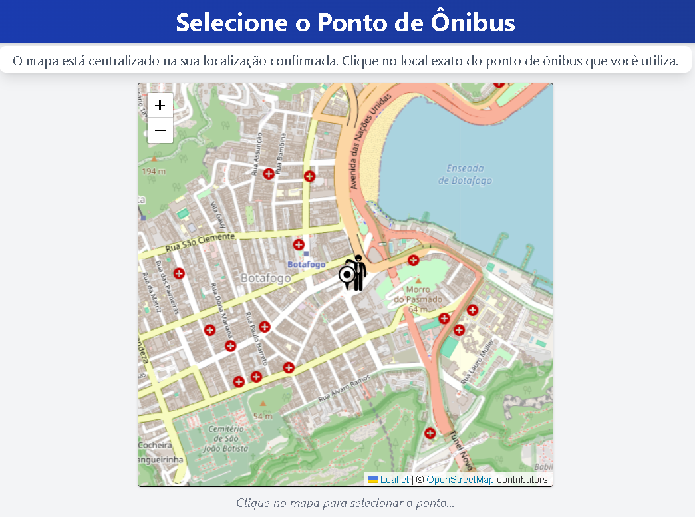  
Com sua localização definida, clique no ponto de ônibus de sua escolha (recomenda-se dar zoom para visualizar os quadrados azuis que representam os pontos de ônibus).  
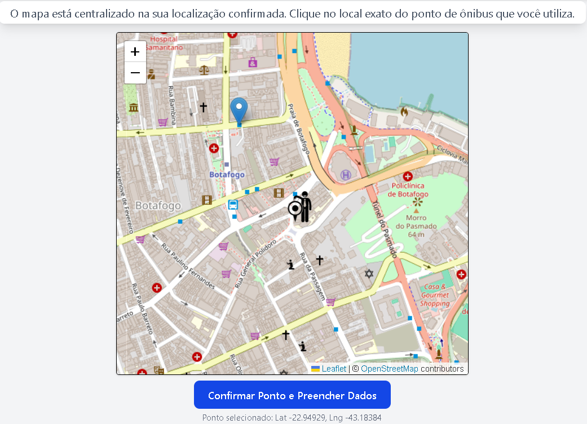  
Ao confirmar, o mapa ficará travado para evitar cliques acidentais em outros pontos. Você pode reiniciar a seleção clicando no botão laranja.  
Um formulário aparecerá depois de selecionar a linha para preencher os detalhes do alerta: email para notificações, linha de ônibus desejada, data e hora.  
A data valida o início dos alertas, enquanto a hora define a janela de envio do lembrete (entre o horário definido e 30 minutos antes).  
Ao selecionar uma linha, os ônibus dessa linha aparecerão no mapa, junto com uma tabela ao lado direito do formulário.  
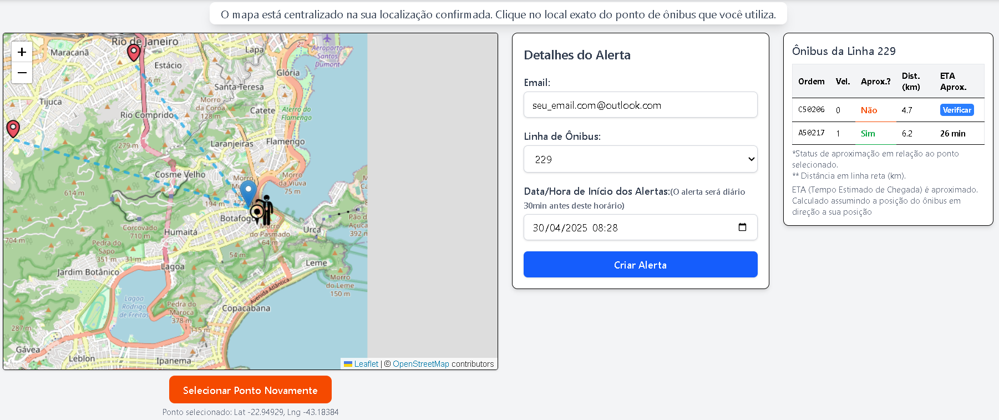  
Talvez seja necessário diminuir o zoom para visualizar os ícones representando cada ônibus. A tabela exibe informações como velocidade em km/h, se o veículo está se aproximando, distância em linha reta até o ponto de ônibus e ETA (tempo estimado de chegada).  
_O ETA é calculado com base no percurso correto, não na distância em linha reta._  
A tabela possui dois estados: se está se aproximando ou não. Esse estado é baseado no comportamento do ônibus nos últimos 20 minutos.  
No momento da imagem acima, o comportamento de cada veículo era:  
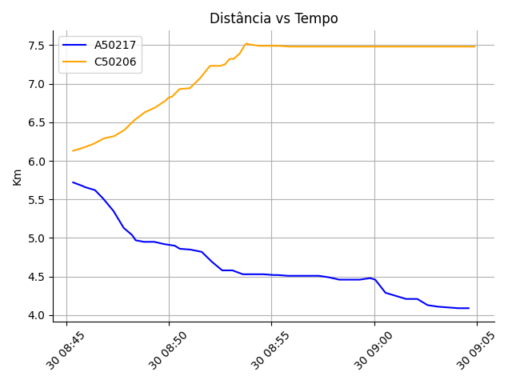  
O ônibus A50217 está se aproximando do ponto de ônibus, enquanto o C50206 estava se distanciando e ficou estável, indicando que parou em algum local de estacionamento.  
Se desejar o ETA de um ônibus se afastando, clique no botão "Verificar" e ele trará o ETA desse ônibus, considerando a localidade atual do ônibus e o destino como o ponto de ônibus.  
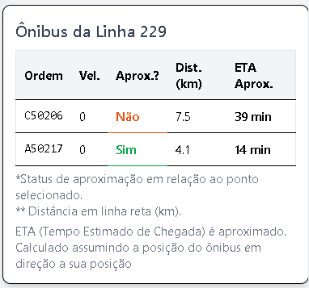  
O print acima foi tirado alguns minutos após os anteriores, mostrando que o ônibus A50217 chegou mais próximo do ponto de ônibus desejado. Você pode clicar nos ícones de localização dos ônibus para saber qual é qual.  
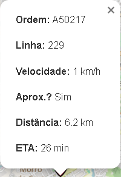  
Por fim, clique no botão "Criar Alerta" para criar seu alerta, e um email de confirmação será enviado para você.  
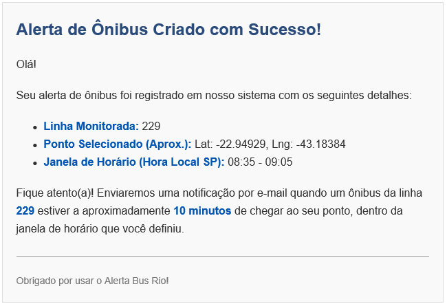  
Quando o alerta for disparado, você receberá outro e-mail de notificação  
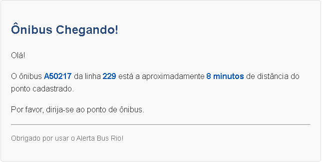

## Contato

Desenvolvido por **Lucas Marciano** - [E-mail](mailto:lucas.marciano99@outlook.com)

- [GitHub](https://github.com/Lucas-I-Marciano)
- [LinkedIn](https://www.linkedin.com/in/lucas-ioran-marciano/)

## Licença

Distribuído sob a Licença MIT. Veja `LICENSE` para mais informações (se houver um arquivo LICENSE).

[MIT License](https://opensource.org/licenses/MIT)
